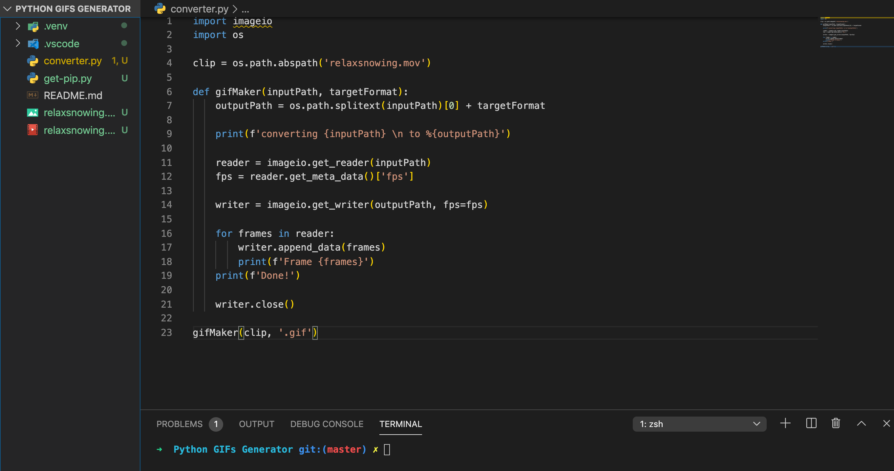

# Python-gif-converter
### This small app was built using Python version 3.  I coded along with a video tutorial and had successfully ran it!

# To install & run:
### git clone, cd into directory, 
### open up text editor or Visual Studio Code, move the video you want to convert into this directory(recommend small size video)
### in line#4 "clip = os.path.abspath('relaxsnowing.mov')", replace the video file name into your video file name (make sure the video file is at the same path as "converter.py")
### open up terminal in VS Code, type "Python converter.py" and it will convert your video into gif, you will see your finished gif inside the directory.

